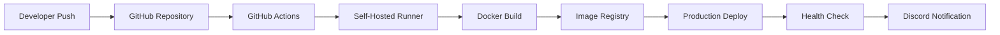

# 🤖 VSB Discord Moderation Bot

<p align="center">
  
  
  
  
  
  
  
</p>

<p align="center">
  
  
  
  
  
</p>

---

## 📋 Table of Contents

- [🚀 Features](#-features)
- [🏗️ Architecture](#️-architecture)
- [⚡ Quick Start](#-quick-start)
- [🔧 Installation](#-installation)
- [⚙️ Configuration](#️-configuration)
- [🛠️ Core Functions](#️-core-functions)
- [🔒 Jail System](#-jail-system)
- [📊 Services Overview](#-services-overview)
- [🚀 Deployment](#-deployment)
- [🔧 Development](#-development)
- [🛡️ Security](#️-security)
- [🔐 Environment Variables](#-environment-variables)
- [📚 API Reference](#-api-reference)
- [🤝 Contributing](#-contributing)
- [📄 License](#-license)

---

## 🚀 Features

### 🛡️ **Advanced Moderation**
- **Intelligent Jail System** - Three-tier restriction system (timeout, hornyjail, specific channel)
- **Automated Warning System** - Persistent warning tracking with escalating punishments
- **Hall of Shame** - Automatic detection and logging of rule violations
- **Audit Logging** - Complete message edit/delete tracking with Discord webhook integration
- **Anti-Spam Protection** - Message frequency and content monitoring

### 🎮 **User Engagement**
- **XP & Leveling System** - Gamified user engagement with level roles
- **Hall of Fame** - Highlight popular messages with reaction thresholds
- **Welcome System** - Dynamic welcome messages with Tenor GIF integration
- **Fun Commands** - Interactive user commands (hug, kiss, slap, wave, etc.)
- **Text Formatting** - Rich text manipulation tools and code snippet formatting

### 🔧 **Administration Tools**
- **Slowmode Management** - Dynamic channel slowmode control with time parsing
- **User Management** - Comprehensive moderation (kick, ban, timeout, role management)
- **Statistics Dashboard** - Server analytics and user metrics with visual reports
- **Temporary Voice Channels** - Auto-creating/deleting voice rooms with permissions
- **Configuration Management** - Live configuration viewing and editing via slash commands

### ⚙️ **Technical Features**
- **Self-Hosted CI/CD** - GitHub Actions with self-hosted runner deployment
- **Containerized Deployment** - Docker with production-grade orchestration
- **Health Monitoring** - Comprehensive health endpoints with Prometheus metrics
- **Database Integration** - SQLite with automated backups and migrations
- **Security Hardening** - Firewall, fail2ban, and container security
- **Auto-Scaling** - Resource limits and auto-restart capabilities

---

## 🏗️ Architecture

```mermaid
graph TB
    A[GitHub Repository] --> B[GitHub Actions CI/CD]
    B --> C[Self-Hosted Runner]
    C --> D[Docker Build & Deploy]
    D --> E[Production Environment]
    
    E --> F[Discord Bot Container]
    E --> G[Nginx Reverse Proxy]
    E --> H[Prometheus Monitoring]
    E --> I[Grafana Dashboard]
    
    F --> J[SQLite Database]
    F --> K[Health Endpoints]
    F --> L[Service Layer]
    
    L --> M[Jail Service]
    L --> N[Moderation Service]
    L --> O[Statistics Service]
    L --> P[Welcome Service]
    L --> Q[Audit Service]
    
    K --> R[/health]
    K --> S[/status]
    K --> T[/metrics]
    
    U[Discord API] <--> F
    V[Tenor API] <--> F
    W[Discord Webhooks] <--> F
```

### 🗂️ **Project Structure**

```
py_VSB_Discord_Moderation_BOT/
├── 🐳 Dockerfile                           # Production container configuration
├── 📋 docker-compose.production.yml       # Production orchestration
├── 🛠️ setup_server.sh                     # Automated server setup script
├── 📦 requirements.txt                     # Python dependencies
├── ⚙️ pyproject.toml                       # Project configuration
├── 🔄 .github/workflows/deploy.yml        # CI/CD pipeline configuration
├── 📝 README.md                           # This documentation
├── 📄 LICENSE                             # GPL-3.0 License
├── 🤖 bot/                                # Main bot application
│   ├── 📍 app.py                          # Application entry point
│   └── 🧩 vsb_bot/                        # Core bot package
│       ├── 🚀 startup.py                  # Bot initialization and service loading
│       ├── ⚙️ configuration.py            # Configuration management
│       ├── 🏥 health_check.py             # Health monitoring endpoints
│       ├── 📡 events.py                   # Discord event handlers
│       ├── 🔧 service.py                  # Base service class
│       ├── 📋 configuration.json          # Bot configuration settings
│       ├── 📊 services/                   # Modular bot services
│       │   ├── 🔒 jail_service.py         # User restriction system
│       │   ├── ⚠️ hall_of_shame_service.py # Violation tracking
│       │   ├── 🌟 hall_of_fame_service.py  # Popular content highlighting
│       │   ├── 📊 statistics_service.py    # Analytics and metrics
│       │   ├── 👋 welcome_service.py       # Member onboarding
│       │   ├── 🔧 user_management_*.py     # Admin and user commands
│       │   ├── 📝 text_formatter_service.py # Text manipulation tools
│       │   ├── 🎵 reaction_service.py      # Interactive responses
│       │   ├── 🔄 slowmode_service.py      # Chat control
│       │   ├── 📋 audit_service.py         # Message logging
│       │   ├── ⏰ remind_me_service.py     # Reminder system
│       │   └── 🎤 temporary_voice_service.py # Voice channel management
│       └── 🛠️ utils/                      # Utility modules
│           ├── 📝 logger.py               # Logging configuration
│           ├── 🎬 tenor_api_gif.py        # GIF integration
│           └── 🔍 instance_dump.py        # Debug utilities
├── 🐳 nginx/                             # Nginx configuration
│   └── 📄 nginx.conf                     # Reverse proxy settings
├── 📊 monitoring/                        # Monitoring configuration
│   ├── 📄 prometheus.yml                 # Metrics collection
│   └── 📊 grafana/                       # Dashboard configuration
└── 📁 services/                          # Legacy service files (prepared for future migration)
```

---

## ⚡ Quick Start

### 🐍 **Prerequisites**
- **Ubuntu 22.04 LTS** server
- **Python 3.11+**
- **Docker 24.0+** and Docker Compose
- **Discord Bot Token** and **Tenor API Key**
- **GitHub repository** with Actions enabled

### 🚀 **Production Deployment (Recommended)**

```bash
# 1. SSH to your server
ssh majorluk@bot001

# 2. Download and run setup script
wget https://raw.githubusercontent.com/KasheK420/py_VSB_Discord_Moderation_BOT/main/setup_server.sh
chmod +x setup_server.sh
sudo ./setup_server.sh

# 3. Configure GitHub Actions runner
sudo -u github-runner /home/github-runner/actions-runner/config.sh \
  --url https://github.com/KasheK420/py_VSB_Discord_Moderation_BOT \
  --token YOUR_RUNNER_TOKEN

# 4. Start runner service
sudo systemctl enable github-runner
sudo systemctl start github-runner

# 5. Push to main branch triggers automatic deployment
git push origin main
```

### 🖥️ **Local Development**

```bash
# 1. Clone repository
git clone https://github.com/KasheK420/py_VSB_Discord_Moderation_BOT.git
cd py_VSB_Discord_Moderation_BOT

# 2. Create virtual environment
python3 -m venv venv
source venv/bin/activate  # Linux/Mac
# or
venv\Scripts\activate  # Windows

# 3. Install dependencies
pip install -r requirements.txt

# 4. Configure environment
cp .env.template .env
nano .env  # Edit with your values

# 5. Run bot
python -m bot.app
```

---

## 🔧 Installation

### 📦 **System Requirements**

| Component | Minimum | Recommended |
|-----------|---------|-------------|
| **OS** | Ubuntu 20.04+ | Ubuntu 22.04 LTS |
| **Python** | 3.11+ | 3.11+ |
| **RAM** | 1GB | 2GB+ |
| **Storage** | 10GB | 20GB+ |
| **CPU** | 2 Cores | 4+ Cores |
| **Network** | 10 Mbps | 100 Mbps+ |

### 🔨 **Automated Installation**

The setup script handles everything automatically:

```bash
# Download and execute setup script
curl -O https://raw.githubusercontent.com/KasheK420/py_VSB_Discord_Moderation_BOT/main/setup_server.sh
chmod +x setup_server.sh
sudo ./setup_server.sh
```

**What the script installs:**
- ✅ Docker Engine and Docker Compose
- ✅ GitHub Actions self-hosted runner
- ✅ UFW firewall with security rules
- ✅ Fail2ban intrusion prevention
- ✅ Automatic security updates
- ✅ Log rotation and backup systems
- ✅ Systemd services and monitoring

### 🛠️ **Manual Installation** (Advanced Users)

<details>
<summary>Click to expand manual installation steps</summary>

```bash
# 1. Update system
sudo apt update && sudo apt upgrade -y

# 2. Install Docker
curl -fsSL https://get.docker.com -o get-docker.sh
sudo sh get-docker.sh

# 3. Install Docker Compose
sudo curl -L "https://github.com/docker/compose/releases/latest/download/docker-compose-$(uname -s)-$(uname -m)" -o /usr/local/bin/docker-compose
sudo chmod +x /usr/local/bin/docker-compose

# 4. Create bot user
sudo useradd -r -d /opt/discord-bot -s /bin/bash botuser
sudo usermod -aG docker botuser

# 5. Clone repository
sudo git clone https://github.com/KasheK420/py_VSB_Discord_Moderation_BOT.git /opt/discord-bot
sudo chown -R botuser:botuser /opt/discord-bot

# 6. Configure and start services
sudo systemctl enable docker
sudo systemctl start docker
```
</details>

---

## ⚙️ Configuration

### 🔐 **Environment Variables**

The bot automatically creates its environment file from GitHub secrets during deployment. See the [Environment Variables](#-environment-variables) section for complete details.

### 📋 **Bot Configuration**

Edit `bot/vsb_bot/configuration.json`:

```json
{
  "channels": {
    "meme": 690424189173235763,
    "audit-log": 1333178032327753779,
    "welcome": 631134273662877696
  },
  "roles": {
    "host": 690325052658548756,
    "student": 691417700949295114,
    "admin": [631140434332221462, 689908370018402343]
  },
  "services": {
    "jail_service": {
      "enabled": true,
      "max_duration_days": 30,
      "default_timeout": "1h"
    },
    "hall_of_shame": {
      "channel": 1155870576255184916,
      "bad_words": ["spam", "inappropriate"],
      "warning_thresholds": {
        "timeout_5min": 3,
        "timeout_15min": 5,
        "timeout_1day": 10,
        "kick": 20,
        "ban": 30
      }
    },
    "welcome_service": {
      "channel": 631134273662877696,
      "text_templates": [
        "Welcome aboard, {user}! 🎉",
        "Hey {user}, welcome to VSB! 😎"
      ],
      "gif_keywords": ["welcome", "hello", "wave"]
    }
  }
}
```

---

## 🛠️ Core Functions

### 🚀 **Application Lifecycle**

The bot follows a structured initialization process:

1. **Environment Loading** - Load configuration and secrets
2. **Service Discovery** - Dynamically load all service modules
3. **Discord Client Setup** - Initialize with proper intents
4. **Health Monitoring** - Start health check endpoints
5. **Event Registration** - Register all Discord event handlers
6. **Service Initialization** - Start all loaded services
7. **Bot Authentication** - Connect to Discord and sync commands

### 🏥 **Health Monitoring**

The bot provides comprehensive health monitoring:

| Endpoint | Purpose | Response |
|----------|---------|----------|
| `/health` | Basic health check | Bot status and uptime |
| `/status` | Detailed status | Guild info, latency, services |
| `/metrics` | Prometheus metrics | Performance and usage data |

```bash
# Check bot health
curl http://localhost:8081/health

# Get detailed status
curl http://localhost:8081/status

# View metrics
curl http://localhost:8081/metrics
```

---

## 🔒 Jail System

The jail system is the flagship feature providing sophisticated user restriction capabilities.

### 🏛️ **Jail Types**

#### **1. 🔒 Timeout Jail**
- **Purpose**: Complete server isolation
- **Implementation**: Removes all permissions and voice access
- **Use Case**: Severe violations requiring total restriction

#### **2. 🔞 Hornyjail**
- **Purpose**: Redirect to designated rehabilitation channel
- **Implementation**: Access only to specific hornyjail channel
- **Use Case**: Inappropriate behavior requiring guided discussion

#### **3. 🎯 Specific Channel Jail**
- **Purpose**: Targeted channel restrictions
- **Implementation**: Channel-specific permission overrides
- **Use Case**: Disruption in particular channels only

### ⏰ **Duration System**

Flexible duration parsing supports:
- **Minutes**: `30m`, `45m`
- **Hours**: `2h`, `12h`
- **Days**: `1d`, `7d`
- **Maximum**: 30 days per jail

### 🛡️ **Security Features**

- **Permission Validation** - Admin role verification
- **Audit Trail** - Complete logging of all actions
- **Auto-Release** - Automatic expiration handling
- **Backup Protection** - Database backup before changes
- **Appeal System** - Built-in appeal and review process

---

## 📊 Services Overview

### 🔧 **Core Services**

| Service | Purpose | Key Features |
|---------|---------|--------------|
| **🔒 JailService** | User restrictions | 3-tier system, auto-release, audit trail |
| **⚠️ HallOfShameService** | Content moderation | Auto-detection, progressive punishment |
| **📊 StatisticsService** | Analytics | Server metrics, user analytics, leaderboards |
| **👋 WelcomeService** | Member onboarding | Dynamic messages, GIF integration |
| **📋 AuditService** | Activity logging | Edit/delete tracking, webhook notifications |

### 🎮 **Engagement Services**

| Service | Purpose | Key Features |
|---------|---------|--------------|
| **🌟 HallOfFameService** | Popular content | Reaction thresholds, auto-highlighting |
| **🎵 ReactionService** | Interactive responses | Text/GIF reactions, keyword triggers |
| **🔧 UserManagementService** | User tools | Fun commands, text formatting |
| **🎤 TemporaryVoiceService** | Voice channels | Auto-creation, cooldowns, permissions |
| **⏰ RemindMeService** | Reminders | Scheduled notifications, natural language |

### 🛠️ **Utility Services**

| Service | Purpose | Key Features |
|---------|---------|--------------|
| **⚙️ ConfigurationService** | Config management | Live viewing, admin commands |
| **📝 LoggerService** | Debug logging | Activity tracking, error reporting |
| **📝 TextFormatterService** | Content creation | Rich embeds, code snippets |
| **🔄 SlowmodeService** | Chat control | Dynamic slowmode, admin triggers |

---

## 🚀 Deployment

### 🏗️ **Production Deployment Architecture**



### 🔄 **CI/CD Pipeline**

The deployment process is fully automated:

1. **🧪 Testing Phase** (GitHub-hosted runner)
   - Code quality checks with Ruff
   - Security scanning with Bandit
   - Unit tests with pytest
   - Dependency validation

2. **🏗️ Build Phase** (Self-hosted runner)
   - Docker image building
   - Image pushing to registry
   - Environment file creation

3. **🚀 Deploy Phase** (Self-hosted runner)
   - Service health checks
   - Rolling deployment
   - Health verification
   - Discord notifications

4. **🔄 Rollback Phase** (On failure)
   - Automatic rollback to previous version
   - Service restoration
   - Failure notifications

### 📊 **Monitoring Stack**

- **📈 Prometheus** - Metrics collection and alerting
- **📊 Grafana** - Visual dashboards and reporting
- **🔍 Health Endpoints** - Real-time status monitoring
- **📝 Centralized Logging** - Aggregated log analysis
- **🚨 Discord Webhooks** - Instant notifications

---

## 🔧 Development

### 🏠 **Local Development Setup**

```bash
# 1. Clone and setup
git clone https://github.com/KasheK420/py_VSB_Discord_Moderation_BOT.git
cd py_VSB_Discord_Moderation_BOT

# 2. Create virtual environment
python3 -m venv venv
source venv/bin/activate

# 3. Install development dependencies
pip install -r requirements.txt
pip install pytest black ruff mypy bandit safety

# 4. Setup environment
cp .env.template .env
# Edit .env with your development values

# 5. Run in development mode
export DEVELOPMENT_MODE=true
python -m bot.app
```

### 🧪 **Testing Framework**

```bash
# Run all tests
pytest

# Run with coverage
pytest --cov=bot --cov-report=html

# Code formatting
black bot/

# Linting
ruff check bot/

# Type checking
mypy bot/

# Security scanning
bandit -r bot/
safety check
```

### 🔌 **Creating New Services**

```python
# bot/vsb_bot/services/my_service.py
from ..service import Service
import discord

def __service__():
    return MyService()

class MyService(Service):
    async def on_ready(self):
        print("MyService is ready!")
    
    async def on_message(self, message: discord.Message):
        if message.content == "!hello":
            await message.channel.send("Hello, World!")
    
    def __register_commands__(self):
        @self.commands.command(name="mycommand")
        async def my_command(interaction: discord.Interaction):
            await interaction.response.send_message("My custom command!")
```

---

## 🛡️ Security

### 🔒 **Security Features**

#### **🔐 Environment Security**
- **Encrypted Secrets** - GitHub secrets for sensitive data
- **File Permissions** - Restricted access (600) to environment files
- **User Isolation** - Dedicated system user for bot execution
- **Container Security** - Non-root user in containers

#### **🛡️ Application Security**
- **Input Validation** - All user inputs sanitized and validated
- **Rate Limiting** - Command cooldowns prevent spam and abuse
- **Permission Checks** - Admin commands require proper Discord permissions
- **Audit Logging** - Complete activity logging for accountability
- **SQL Injection Prevention** - Parameterized queries only

#### **🗃️ Database Security**
- **Local SQLite** - No external database connections
- **Backup Encryption** - Compressed and secured backup files
- **Access Controls** - Database file permissions restricted
- **Transaction Safety** - ACID compliance for data integrity

### 🚨 **Security Monitoring**

```bash
# Monitor failed authentication attempts
sudo journalctl -u ssh --since "1 hour ago" | grep "Failed"

# Check bot security logs
sudo journalctl -u discord-bot | grep -i "security\|violation\|unauthorized"

# Monitor resource usage for anomalies
systemctl show discord-bot --property=MemoryCurrent,CPUUsageNSec

# Check firewall status
sudo ufw status verbose

# Review fail2ban activity
sudo fail2ban-client status
```

---

## 🔐 Environment Variables

The bot uses environment variables for configuration, automatically managed through GitHub Actions and secrets.

### 🤖 **Discord Configuration**
| Variable | Description | Required |
|----------|-------------|----------|
| `DISCORD_TOKEN` | Discord bot authentication token | ✅ Yes |
| `DISCORD_APPLICATION_ID` | Discord application ID | ✅ Yes |
| `DISCORD_CLIENT_ID` | Discord OAuth2 client ID | ✅ Yes |
| `DISCORD_CLIENT_SECRET` | Discord OAuth2 client secret | ✅ Yes |
| `DISCORD_PUBLIC_KEY` | Discord application public key | ✅ Yes |
| `DISCORD_GUILD_ID` | Target Discord server ID | ❌ Optional |

### 🔑 **API Keys**
| Variable | Description | Required |
|----------|-------------|----------|
| `TENOR_API_KEY` | Tenor GIF API key for GIF responses | ✅ Yes |

### 🗃️ **Database Configuration**
| Variable | Description | Default |
|----------|-------------|---------|
| `DATABASE_PATH` | SQLite database file location | `/app/data/bot_database.db` |
| `DATABASE_BACKUP_PATH` | Backup directory path | `/app/backups` |
| `DATABASE_BACKUP_INTERVAL` | Backup interval in seconds | `86400` (24 hours) |

### 📝 **Logging Configuration**
| Variable | Description | Default |
|----------|-------------|---------|
| `LOG_LEVEL` | Logging level (DEBUG, INFO, WARNING, ERROR) | `INFO` |
| `LOG_FILE_PATH` | Log file location | `/app/logs/discord.log` |
| `LOG_CHANNEL_ID` | Discord channel ID for log messages | Required for audit logging |

### 🔧 **Service Configuration**
| Variable | Description | Default |
|----------|-------------|---------|
| `SERVICE_WHITELIST` | Comma-separated list of services to load | All services |
| `MAINTENANCE_MODE` | Disable bot functionality for maintenance | `false` |
| `DEBUG_MODE` | Enable debug logging and features | `false` |
| `DEVELOPMENT_MODE` | Enable development-specific features | `false` |

### 🔒 **Security Configuration**
| Variable | Description | Required |
|----------|-------------|----------|
| `SECRET_KEY` | Secret key for session management | ✅ Yes |

### 🏥 **Health Check Configuration**
| Variable | Description | Default |
|----------|-------------|---------|
| `HEALTH_CHECK_ENABLED` | Enable health check endpoints | `true` |
| `HEALTH_CHECK_PORT` | Health check server port | `8081` |
| `METRICS_ENABLED` | Enable Prometheus metrics | `true` |

### 📢 **Notification Configuration**
| Variable | Description | Required |
|----------|-------------|----------|
| `DISCORD_WEBHOOK_URL` | Discord webhook for deployment notifications | ❌ Optional |

### 🐳 **Docker Configuration**
| Variable | Description | Required |
|----------|-------------|----------|
| `DOCKER_USERNAME` | Docker Hub username for image registry | ✅ Yes (CI/CD) |
| `DOCKER_PASSWORD` | Docker Hub token for authentication | ✅ Yes (CI/CD) |

### 🌍 **Environment Identification**
| Variable | Description | Default |
|----------|-------------|---------|
| `ENVIRONMENT` | Environment identifier (production, staging, dev) | `production` |
| `SERVER_NAME` | Server identifier for logging | `bot001` |
| `BOT_VERSION` | Current bot version/commit hash | Auto-generated |
| `DEPLOYMENT_ID` | Unique deployment identifier | Auto-generated |

---

## 📚 API Reference

### 🔧 **Configuration API**

```python
from bot.vsb_bot.configuration import Configuration

# Get configuration values
meme_channel = Configuration.get("channels.meme")
admin_roles = Configuration.get("roles.admin", [])

# Check service settings
jail_enabled = Configuration.get("services.jail_service.enabled", True)
```

### 🗃️ **Database API**

```python
# Example database operations (implement as needed)
# The bot uses SQLite with direct SQL queries

import sqlite3

def add_user_warning(user_id: int, admin_id: int, reason: str):
    """Add a warning to the database"""
    pass

def get_user_warnings(user_id: int) -> list:
    """Get all warnings for a user"""
    pass

def log_jail_action(user_id: int, jail_type: str, duration: int):
    """Log a jail action"""
    pass
```

### 🎯 **Service API**

```python
# Custom service implementation
from bot.vsb_bot.service import Service

class MyService(Service):
    async def on_message(self, message):
        """Handle incoming messages"""
        pass
    
    async def on_member_join(self, member):
        """Handle new member joins"""
        pass
    
    def __register_commands__(self):
        """Register slash commands"""
        @self.commands.command(name="example")
        async def example_command(interaction):
            await interaction.response.send_message("Example!")
```

### 🏥 **Health Check API**

| Endpoint | Method | Description | Response |
|----------|--------|-------------|----------|
| `/health` | GET | Basic health check | `{"status": "healthy", "uptime": 3600}` |
| `/status` | GET | Detailed status info | Comprehensive bot and guild information |
| `/metrics` | GET | Prometheus metrics | Metrics in Prometheus format |

---

## 🤝 Contributing

### 🚀 **Getting Started**

1. **🍴 Fork the repository**
2. **🌿 Create feature branch**: `git checkout -b feature/amazing-feature`
3. **💾 Commit changes**: `git commit -m 'Add amazing feature'`
4. **📤 Push branch**: `git push origin feature/amazing-feature`
5. **🔄 Open Pull Request**

### 📋 **Development Guidelines**

#### **📝 Code Style**
- Use **Black** for code formatting: `black bot/`
- Follow **PEP 8** naming conventions
- Add **type hints** for all function parameters and returns
- Write **comprehensive docstrings** for classes and methods
- Use **Ruff** for linting: `ruff check bot/`

#### **🧪 Testing Requirements**
- Add unit tests for new features in `tests/`
- Ensure all tests pass: `pytest`
- Test with actual Discord server using test bot
- Verify database migrations work correctly
- Include integration tests for complex features

#### **🔒 Security Guidelines**
- Never commit secrets or tokens
- Validate all user inputs
- Use parameterized queries for database operations
- Follow principle of least privilege
- Security scan with: `bandit -r bot/`

#### **📚 Documentation**
- Update README.md for new features
- Add docstrings following Google style
- Include configuration examples
- Document any breaking changes
- Update API documentation

### 🐛 **Bug Reports**

When reporting bugs, please include:
- **Environment**: OS, Python version, Discord.py version
- **Configuration**: Relevant configuration (redact secrets)
- **Steps to Reproduce**: Clear reproduction steps
- **Expected vs Actual**: What you expected vs what happened
- **Logs**: Relevant log entries (redact sensitive info)
- **Screenshots**: If applicable

### 💡 **Feature Requests**

For feature requests, please describe:
- **Use Case**: Why this feature is needed
- **Implementation**: Suggested implementation approach
- **Impact**: How it affects existing functionality
- **Alternatives**: Other solutions considered
- **Priority**: High, Medium, or Low

---

## 📄 License

This project is licensed under the **GNU General Public License v3.0** - see the [LICENSE](LICENSE) file for details.

### 📝 **License Summary**

✅ **Permitted**:
- Commercial use
- Modification and distribution
- Patent use
- Private use

❌ **Limitations**:
- No warranty provided
- No liability assumed

📋 **Conditions**:
- Include license and copyright notice
- State changes made to the code
- Disclose source code
- Use same license for derivatives

---

## 🙏 Acknowledgments

- **[Discord.py](https://github.com/Rapptz/discord.py)** - Excellent Discord API wrapper
- **[SQLite](https://www.sqlite.org/)** - Reliable embedded database
- **[Docker](https://www.docker.com/)** - Containerization platform
- **[GitHub Actions](https://github.com/features/actions)** - Seamless CI/CD pipeline
- **[Tenor API](https://tenor.com/developer)** - GIF integration capabilities
- **[Prometheus](https://prometheus.io/)** - Monitoring and alerting
- **[Grafana](https://grafana.com/)** - Beautiful dashboards
- **[Open Source Community](https://github.com/)** - Inspiration and best practices

---

## 📞 Support

### 💬 **Getting Help**

- **📖 Documentation**: Check this README and inline documentation
- **🐛 Issues**: [GitHub Issues](https://github.com/KasheK420/py_VSB_Discord_Moderation_BOT/issues)
- **💡 Discussions**: [GitHub Discussions](https://github.com/KasheK420/py_VSB_Discord_Moderation_BOT/discussions)
- **📧 Contact**: Create an issue for support requests

### 🔍 **Troubleshooting**

#### **🚫 Common Issues**

| Issue | Diagnosis | Solution |
|-------|-----------|----------|
| **Bot not responding** | `sudo systemctl status discord-bot` | Check logs: `sudo journalctl -u discord-bot` |
| **Database errors** | Check disk space: `df -h` | Verify permissions and space |
| **Permission errors** | Check bot Discord permissions | Update bot permissions in Discord |
| **Health check fails** | `curl http://localhost:8081/health` | Verify port 8081 is open |
| **CI/CD failures** | Check GitHub Actions logs | Verify secrets and runner status |

#### **📊 Health Check Commands**

```bash
# Service status
sudo systemctl status discord-bot

# Recent logs  
sudo journalctl -u discord-bot --since "1 hour ago"

# Resource usage
systemctl show discord-bot --property=MemoryCurrent

# Database check
ls -la /opt/discord-bot/data/

# Manual health check
curl http://localhost:8081/health

# GitHub runner status
sudo systemctl status github-runner
```

#### **🚨 Emergency Procedures**

```bash
# Complete restart
sudo systemctl stop discord-bot
sudo docker system prune -f
sudo systemctl start discord-bot

# View all processes
ps aux | grep -E "(bot|docker)"

# Check disk space
df -h

# Check memory usage
free -h

# Network connectivity test
curl -I https://discord.com/api
```

---

## 🔗 Quick Links

### 📍 **Repository Links**
- **Main Repository**: https://github.com/KasheK420/py_VSB_Discord_Moderation_BOT
- **GitHub Actions**: https://github.com/KasheK420/py_VSB_Discord_Moderation_BOT/actions
- **Issues**: https://github.com/KasheK420/py_VSB_Discord_Moderation_BOT/issues
- **Releases**: https://github.com/KasheK420/py_VSB_Discord_Moderation_BOT/releases
- **Wiki**: https://github.com/KasheK420/py_VSB_Discord_Moderation_BOT/wiki

### 🛠️ **Development Tools**
- **Discord.py Documentation**: https://discordpy.readthedocs.io/
- **Docker Documentation**: https://docs.docker.com/
- **GitHub Actions Documentation**: https://docs.github.com/en/actions
- **Tenor API Documentation**: https://tenor.com/developer

### 📊 **Monitoring & Health**
- **Health Check**: http://localhost:8081/health
- **Status Endpoint**: http://localhost:8081/status
- **Metrics**: http://localhost:8081/metrics
- **Prometheus**: http://localhost:9090
- **Grafana**: http://localhost:3000

---

<p align="center">
  <strong>🤖 Built with ❤️ for the VSB Discord Community</strong>
</p>

<p align="center">
  
  
  
  
</p>